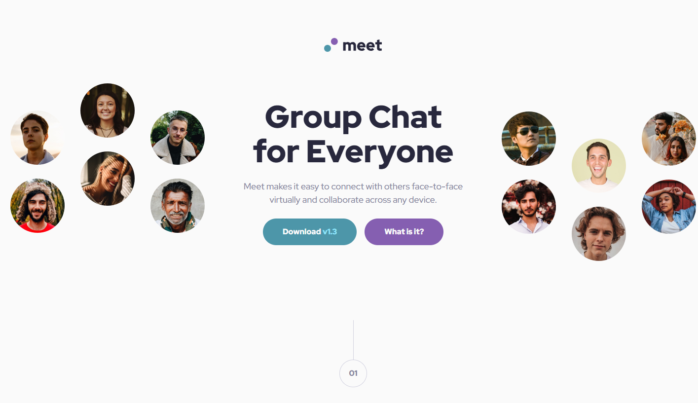

# Frontend-Mentor-Project-08-Meetup-Landing-Page
My attempt at Frontend Mentor Responsive Design Path - Project 4
This is a solution to the [Meet Landing Page challenge on Frontend Mentor](https://www.frontendmentor.io/challenges/meet-landing-page-rbTDS6OUR). Frontend Mentor challenges help you improve your coding skills by building realistic projects. 

## Table of contents

- [Overview](#overview)
  - [The challenge](#the-challenge)
  - [Screenshot](#screenshot)
- [My process](#my-process)
  - [Built with](#built-with)
  - [What I learned](#what-i-learned)
  - [Continued development](#continued-development)
- [Author](#author)
- [Acknowledgments](#acknowledgments)

## Overview

Culmination project of skills learned over Responsive Design Course. Grids, Flex boxes, and more were used in reproducing from mockup.

### Screenshot

## My process

Mobile first as is tradition. This was the most extensive mockup I had to design and I encountered a lot of tricky moments that make me understand why this was selected for the final project in the learning path. It also featured some images for mobile/tablet/desktop, and I briefly attempted leveraging the `<picture>` tag to swap out elements. That said, the assets were the exact same resolution between desktop and mobile, so I didn't see the value in a resource swap with resize. Additionally, I switched the top third of the page from a flex layout to a grid. I found that much easier to work with. 

"gluing" the two images together for mobile and tablet was done with variable gap width on viewport resize. Admittedly I eyeballed it for this project but I am satisfied with the outcome and it makes for a smooth resize.

Variable fonts and padding were used nearly everywhere in this project, leaving a lot of unused CSS variables, which I would certainly be cleaning up in a live site. Build initially was made with those static values and I then swapped out for a cleaner resize transition.

Step Counters were my first unusual challenge. They overlap elements in the normal document flow and they have a vertical line acting to form a lollipop shape. I initially went at this project with a `::before` pseudoelement and ran up against the fact that those pseudoelements have default inline properties and other details that make it no easier in this circumstance to work with than a standard div. My solution with a typical `
` and a centered flex-box was giving much cleaner results in my testing. 

Getting it to overlap the bottom element was also an interesting challenge I haven't run up against before. I admittedly first tried making it a static element, but I wasn't happy with the outcome or the problems it caused on resize. Turns out the most satisfying answer was just a negative `margin-top` on the lower object to force overlap. I am nearly certain that this would not have worked for a situation using `margin-bottom`, but I will use what I can!

Turns out I do not have a lot of experience leveraging CSS `background` properties and that took some experimentation. I initially tried using `<picture>` elements, but I was doing way too much effort for not enough payoff when trying to get that, plus a filter element, plus a flexbox all aligned perfectly. One option I could have tried that I think would have worked was actually a grid with 1 row and 1 column, just stacking everything on top of each other, but I didn't see the need. Getting the filter to work was also harder than expected. I initially thought that I would be able to do it purely with CSS, but unbeknownst to me at the time, there are minimal filter options in CSS, mostly limited to sepia and grayscale filters. Solution I found was to use an absolute positioned element and leverage `opacity` to make it partially see-through. Additionally, I needed to leverage `z-index` values to make it not block the subsequent sibling elements, and I needed to be a lot more careful with the HTML ordering than I though I would. Overall I am satisfied with the outcome.

One thing I am stumped on is alt text for my images. I don't think any of the images in this project are "necessary" to the user's understanding, but also I am coming from a bias of being a user without visual impairment. Like does a visually impaired person really want to hear "group of people laughing by a screen?" Are they missing out from a website delivered in a more bare format? Genuinely not sure. Working on these pure HTML and CSS projects has given me way more insight and general interest into what I should be doing to make my web pages accessible to all users. I have a lot of ignorance working against me as I build and I want to do my best to overcome that. I think that at some point in the near future I want to actually try some screen readers and just get the experience of navigating the web with audio cues. I am currently designing for a software I've never even seen utilized, so I think that perspective would help me moving forward.

### Built with

- Semantic HTML5 markup
- CSS custom properties
- Flexbox
- Grid

### What I learned

I learned a lot! Big picture, I learned that sometimes I'm going to think I have a better plan than I do. Image selection and swapping was quite challenging at the start, and my asset properties significantly shifted my plans for this project. Lots of little things creates big changes to how this build played out, and it was a good bit of fun.

Power of negative `margin-top` values is clear from this project. Also, I learned a lot about CSS `background` properties. For instance, positioning and sizing the images was a lot more detail than I thought I would need to implement.

I also got a lot better with wrappers! I don't think I have ever used wrappers in a grid before, and that detail added a bit of abstraction to my grid sizing that created some wonky interactions. Still, those wrappers seemed necessary for a number of reasons, and it produced a very satisfying edge-to-edge image cover without distorting viewport sizing. 

### Continued development

I really want to animate the transition from tablet view to desktop on resize. It's silly, I know, but having a smooth shift of the middle grid item and the subsequent items in the HTML would look so clean and satisfying. I played around with that sort of animation and I was hitting some issues that made me walk back and focus on the main design, but I would like to try that again. Seems to need some javascript to pull off, since I need to invert the animation timing for viewport growth vs. shrink, but I still think it'd be a cute touch. Also the layout of the buttons shifts from column to row in a way that will not work smoothly without a bit of GSAP or general FLIP implementation.

I strongly dislike webpages with abrupt position changes and appreciate the continuity that comes with elements that my eyes can track. Something about that ability to track positional changes gives page elements a level of physicality that makes the entire page feel more intuitive and pleasant to interact with. I've learned a lot of techniques through my work projects that let me animate with minimal javascript and provide a clean, smooth set of animations with minimal resource utilization, but I digress.

Most importantly, I would like to rewrite this project from scratch. I think the production would take half the time now and I would make some changes to my build process that I think could improve the end product. I think that when I have a clear idea how to animate the page tranision, I will have another try at this project. That said, I want to move on to a new one. I want to get to the part where I can start implementing all the javascript I have been learning. HTML and CSS are incredible and powerful tools, but I have grown to love writing javascript, janky a language as it is at times.

I probably should have started this README with "Dear Diary".....

## Author

- Frontend Mentor - [@MalakDynamics](https://www.frontendmentor.io/profile/MalakDynamics)

## Acknowledgments

Thanks to Frontend Mentor for all the assets and practice projects!
